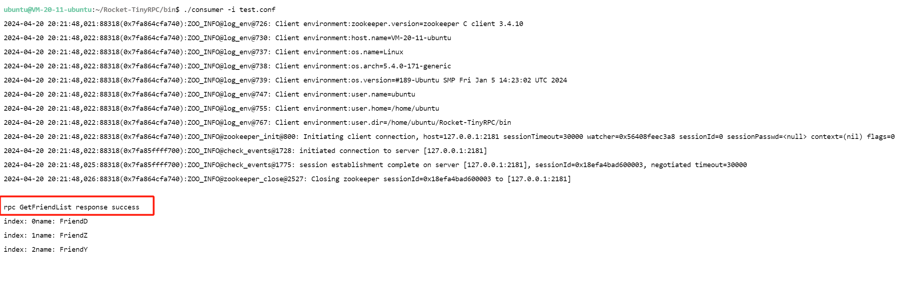

# Rocket-TinyRPC

本项目用C++实现了一个轻量级RPC分布式网络通信框架，通过该框架开发者可以通过网络从远程服务器上请求服务，调用远端服务器上的函数并获取返回结果。


## 1 项目概述

### 1.1 整体架构


### 1.2 RPC调用过程

1. **服务注册**: 服务提供者（Provider）将其提供的远程服务接口及其实现，通过注册到 ZooKeeper 注册中心，发布其服务的相关元数据，包括服务名称、方法、提供者的 IP 地址和端口号等信息。
2. **服务发现**: 服务消费者（Consumer）在需要远程调用服务时，首先向 ZooKeeper注册中心查询所需服务的详细信息，包括服务提供者的位置（IP 和端口号）。这一步称为服务发现。
3. **请求序列化**: 服务消费者根据获取的服务提供者信息，将调用的服务方法名和参数通过序列化转换成网络传输友好的格式，以便网络传输。
4. **发送请求**: 序列化后的数据通过网络发送到服务提供者的指定地址。
5. **请求反序列化**: 服务提供者接收到数据后，进行反序列化操作，解析出原始的服务请求信息，包括服务名和方法参数。
6. **服务执行**: 服务提供者根据反序列化得到的信息，定位到相应的服务方法并在本地执行。
7. **结果序列化**: 执行完成后，服务提供者将执行结果进行序列化处理，准备发送回服务消费者。
8. **发送响应**: 序列化后的执行结果通过网络发送回服务消费者。
9. **结果反序列化**: 服务消费者接收到结果数据后，进行反序列化，恢复成原始的执行结果格式。
10. **结果处理**: 反序列化后的结果交由应用层处理，完成整个远程服务调用流程。


### 1.3 技术栈

- 采用了muduo网络库中的主从Reactor反应堆模型， 借用epoll技术实现多路IO复用, 增加并行服务的数量
- 针对客户端与服务器端的RPC请求和响应，使用Protobuf作为数据序列化和反序列化的私有通信协议
- 以ZooKeeper作为消息中间件， 建立了分布式服务配置中心，所有服务器端的RPC节点均需要向配置中心注册服务。客户端在配置中心可以查询到要调用的对应服务的IP地址、端口号等信息，进行远程调用
- 日志系统采用了单例设计模式，提供了线程安全的异步日志缓冲队列写入操作


## 2 运行

### 2.1 运行环境

操作系统：Ubuntu Server 20.04 LTS 64bit

服务器：CPU - 2核 内存 - 2GB

 预先配置：cmake + protobuf + muduo + zookeeper


### 2.2 项目文件说明

| 文件/文件夹    | 说明                           |
| :------------- | :----------------------------- |
| bin            | 可执行文件                     |
| build          | 项目编译文件                   |
| lib            | 生成的库文件                   |
| src            | 源文件                         |
| test           | 测试代码                       |
| example        | 框架代码使用范例               |
| autobuild.sh   | 一键编译脚本                   |
| README.md      | 自述文件，项目说明，如何使用等 |
| CMakeLists.txt | CMake项目配置文件              |
| .vscode        | Visual Studio Code的配置文件   |
| .assets        | 资源文件                       |

### 2.3 运行

```bash
./autobuild.sh
```


### 2.4 运行结果

1. RPC服务端：


2. RPC客户端：



3. 查看ZooKeeper节点信息和节点的值：


4. tcpdump抓包分析：


设置超时时间为30s，zkClient的IO线程负责网络通信，会以1/3timeout时间发送ping消息作为心跳消息。

5. 日志输出：


## 3 具体实现

### 3.1 序列化和反序列化

- 序列化：对象转为字节序列称为对象的序列化
- 反序列化：字节序列转为对象称为对象的反序列化

常见序列化和反序列化协议有XML、JSON、Protocol Buffers，三者相比Protobuf的优势在于：跨平台语言支持，序列化和反序列化效率高速度快，且序列化后体积比XML和JSON都小很多，适合网络传输。

|                  | XML                  | JSON                | Protocol Buffers                        |
| :--------------- | :------------------- | :------------------ | --------------------------------------- |
| 保存方式         | 文本                 | 文本                | 二进制                                  |
| 可读性           | 较好                 | 较好                | 一般                                    |
| 解析效率         | 慢                   | 一般                | 快                                      |
| 语言支持         | 所有主流语言         | 所有主流语言        | C++/Java/Python，广泛第三方支持其他语言 |
| 适用范围         | 企业级应用，文档交互 | Web API，前后端通信 | 高性能应用，移动平台，内部通信          |
| 数据大小         | 较大                 | 中等                | 较小                                    |
| 版本控制和扩展性 | 手动处理             | 手动处理            | 良好的向后兼容性和扩展性                |


### 3.2 数据传输格式


RpcHeader 是一个由 Protocol Buffers 定义的消息类型，包含三个字段：服务对象名、服务函数名和函数参数长度。这个RpcHeader可以通过 SerializeToString方法序列化为二进制字符串。

由于函数参数的长度是可变的，每个函数参数列表都有一个相应的 Protocol Buffers 消息类型来定义。这些参数消息也通过 SerializeToString方法序列化为二进制字符串。

最终，为了构建完整的要发送的消息，将RpcHeader的二进制字符串与对应函数参数的二进制字符串进行拼接，形成最终的发送字符串send_str。


### 3.3 ZooKeeper

ZooKeeper 是一个为分布式应用提供一致性协调的中间件，支持单线程（zookeeper_st）和多线程（zookeeper_mt）库，通常使用 zookeeper_mt 库。在使用 zookeeper_mt 库的客户端中，包括三个线程：

- 主线程处理用户API调用
- IO线程负责网络通信
- completion线程处理异步请求的响应和watcher回调

#### 3.3.1 ZNode


ZooKeeper 作为一个特殊的文件系统，其节点可以关联数据，与传统文件系统不同，ZooKeeper仅允许文件节点存放数据。为保持高吞吐与低延迟，ZooKeeper 在内存中维护树状目录结构，限制每个节点数据上限为1MB。在ZooKeeper中，服务对象名以永久性节点形式存在，即使RpcServer断开连接，节点仍保留；方法对象名则以临时节点存在，断开连接时自动删除，临时节点存储提供服务的RpcServer通信地址（IP+端口）。

#### 3.3.2 Watcher

ZooKeeper的Watcher机制是一种事件通知系统，允许客户端订阅特定节点的变化事件。当这些节点发生变化（如数据修改、节点创建或删除）时，ZooKeeper会向所有订阅了相应事件的客户端发送通知。Watcher提供了一种高效的方式来监控和响应分布式环境中的状态变化，而无需轮询，从而减少网络负载和响应时间。Watchers一次性触发，即一旦触发后，客户端需要重新设置Watcher以继续接收事件通知。

ZooKeeper的Watcher机制是观察者模式的分布式实现，允许客户端通过设置Watcher来监控特定znode的变化。这些事件包括节点的创建、删除、数据更新及子节点变更。Watcher是一次性的，事件触发后需重新设置以继续监控。这种机制避免了频繁的状态轮询，降低了网络和处理负载。


### 3.4 日志模块

本项目实现了一个基于单例模式的日志系统，支持INFO和ERROR两种级别，适用于RPC框架多线程写日志，确保线程安全的日志记录。框架采用LockQueue维护一个线程安全的日志队列，允许多个线程将日志首先写入此队列，随后由专门的日志线程异步处理这些日志消息。框架还提供了LOG_INFO和LOG_ERROR宏，简化格式化日志的记录过程。通过GetInstance方法，系统全局提供日志实例，保证日志操作的一致性和效率。


## 4 核心类设计

| 类名                | 主要方法                                                     | 说明                                                         |
| ------------------- | ------------------------------------------------------------ | ------------------------------------------------------------ |
| RocketApplication   | static RocketConfig& GetConfig();                            | 单例模式实现的框架基础类，负责整个应用框架的初始化，如读取配置文件 |
| RocketConfig        | void LoadConfigFile(const char* configFile);    <br />std::string Load(const std::string &key); | 读取和解析配置文件，加载和查询RPC框架的配置项                |
| RocketRpcProvider   | void NotifyService(google::protobuf::Service *service);      | 用于发布和管理RPC服务，通过muduo网络库实现了RPC服务的网络通信功能 |
| RocketRpcController | void Reset();    bool Failed() const;    std::string ErrorText() const;    void SetFailed(const std::string& reason); | 实现了 `google::protobuf::RpcController` 接口，用于控制RPC调用过程中的错误管理和状态反馈 |
| RocketRpcChannel    | void CallMethod(const google::protobuf::MethodDescriptor* method,                          google::protobuf::RpcController* controller, const google::protobuf::Message* request,                          google::protobuf::Message* response,                           google::protobuf::Closure* done); | 处理RPC方法调用的数据序列化和网络通信，该类是RPC客户端的核心组件，负责将客户端的方法调用请求转化为网络消息，发送到远程服务器，并接收服务器的响应。 |

## 